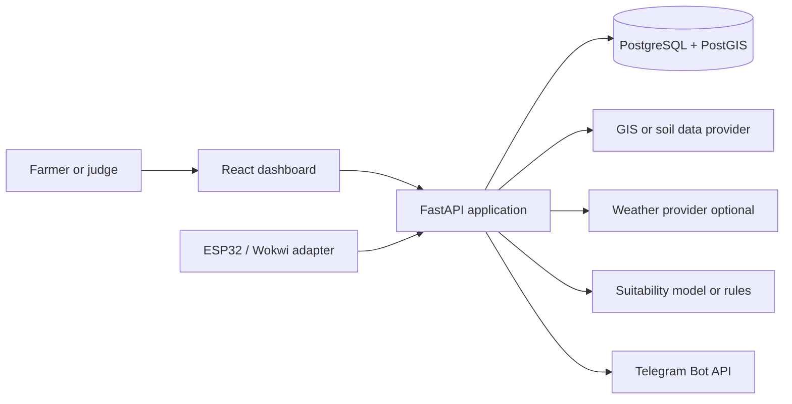
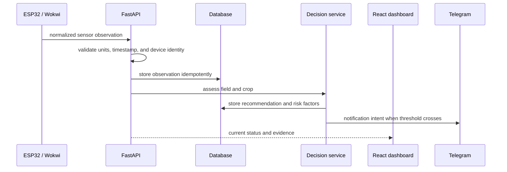

# AgroGuard - Architecture

## Architectural intent

AgroGuard is a demo-first, modular monolith. The architecture should be simple enough to finish in 24 hours, but the boundaries must be clean enough to add crops, sensors, GIS providers, and notification channels without rewriting the core domain.

The system is designed around one decision loop:

`field location -> baseline context -> crop suitability -> live observation -> risk status -> recommendation -> alert -> intervention history`

## Technology decisions

| Area | Decision | Reason |
|---|---|---|
| Frontend | React.js with a consistent component and data-fetching approach | Fast dashboard delivery and a strong visual demo |
| Backend | Python with FastAPI | Typed request validation, async-friendly integrations, and rapid API iteration |
| Persistence | PostgreSQL; enable PostGIS for real field geometry | Reliable relational data plus geospatial queries |
| GIS | Map provider behind a small adapter; use seeded data when provider access fails | Prevents a map API outage from breaking the demo |
| AI | Explainable crop-suitability score plus optional model/provider adapter | A deterministic answer is safer and easier to defend in a judging session |
| IoT | ESP32/Wokwi adapter with normalized readings | Hardware simulation proves the concept without requiring physical deployment |
| Alerts | Telegram adapter behind a notification service | Keeps channel-specific behavior out of crop logic |
| Background work | In-process task or lightweight worker for MVP; outbox-compatible data model | Avoids operating a queue in the 24-hour build while preserving reliability direction |
| Deployment | One documented local or single-host demo deployment | Minimize infrastructure failure points |

Do not add microservices, Kubernetes, a feature store, a streaming platform, or a full MLOps stack during the hackathon.

## System context

## Internal modules

### 1. Field and GIS module

Owns field identity, coordinates or polygon geometry, location lookup, baseline soil and climate context, provider metadata, and coordinate validation.

Rules:

- Store latitude/longitude with a declared coordinate reference system.
- Store field geometry separately from display labels.
- Keep provider name, retrieval time, resolution, and quality notes with imported data.
- Use a seeded field when external GIS access fails.

### 2. Crop knowledge module

Owns crop profiles and requirements, including preferred temperature, pH, moisture, light, season, and export-quality considerations.

Rules:

- Requirements are versioned data, not hidden constants in request handlers.
- Each requirement has a source or an explicit "demo assumption" label.
- Crop suitability is explainable as positive matches and limiting factors.

### 3. Observation module

Owns device readings, manual demo readings, normalized units, timestamps, quality flags, and stale-data detection.

Supported MVP measures:

- Temperature in degrees Celsius.
- Relative humidity in percent.
- Soil moisture as a normalized percentage for the demo.
- Soil pH as a demo estimate, not a laboratory measurement.
- Light level as a normalized percentage.

### 4. Decision module

Owns the health status, risk factors, crop suitability score, recommendation, confidence, and evidence references.

Decision outputs must include:

- Status: `healthy`, `warning`, or `critical`.
- Primary risk factor.
- Recommended next action.
- Evidence values and expected ranges.
- Confidence or data-quality note.
- Whether the output came from live data, seeded data, rules, or an optional model.

### 5. Notification module

Owns alert state, deduplication, cooldowns, Telegram delivery, delivery result, and retry metadata.

The decision module raises an alert intent. It must not call Telegram directly.

### 6. Growth simulation module

Owns the one-year timeline, crop growth stages, IoT-guided scenario, normal-control scenario, and event markers. The simulation is a storytelling layer; it must be labeled as illustrative, not a measured yield forecast.

### 7. Demo control module

Owns reset, seeded scenario selection, simulated clock, and the one-click demo path. Demo controls must be isolated from production-like field data so a reset cannot delete real records.

## Layer responsibilities

### API layer

- Parse and validate HTTP requests.
- Authenticate protected routes when auth is enabled.
- Call an application service.
- Return stable response shapes and status codes.
- Never contain crop rules, SQL queries, Telegram logic, or map-provider details.

### Application/service layer

- Orchestrate a use case such as ingest reading, assess field, or send alert.
- Coordinate repositories and adapters.
- Enforce idempotency and state transitions.
- Emit domain events or notification intents.

### Domain layer

- Define field, crop, observation, risk, recommendation, alert, and simulation concepts.
- Apply pure, testable suitability and status rules.
- Have no dependency on HTTP, database sessions, React, or Telegram.

### Adapter layer

- Implement GIS, weather, model, IoT, and Telegram integrations.
- Translate provider-specific data into internal contracts.
- Expose provider failure as a typed degraded state rather than an unhandled exception.

### Persistence layer

- Store normalized entities and histories.
- Own queries, transactions, indexes, and migrations.
- Never decide which recommendation is best.

## Runtime modes

| Mode | Data sources | Purpose |
|---|---|---|
| Demo mode | Seeded field + Wokwi/manual readings + deterministic rules | Must work offline from external providers |
| Connected mode | GIS/weather providers + IoT readings + rules/model | Shows realistic integration |
| Degraded mode | Last known or seeded context, marked stale | Keeps UI useful and honest during outages |
| Replay mode | Recorded readings and clock control | Makes the same presentation repeatable |

The UI must show the current mode. Never silently mix stale, simulated, and live data.

## Data flow: live observation

## Integration boundaries

### GIS and soil data

Use a provider interface with one seeded implementation and one live implementation. The provider response must be normalized into internal values and include provenance. The application must be able to answer: where did this value come from, when was it fetched, and how reliable is it for this field?

### Weather

Weather is optional for the MVP. If unavailable, the system must use the last known or seeded climate baseline and label it clearly. Do not block the local sensor demo on a weather API.

### ESP32 and Wokwi

The firmware or simulator adapter sends a small normalized observation payload. Wokwi is the preferred reproducible path. LoRaWAN and 4G are future transport options, not required to prove the domain design.

### Telegram

Telegram credentials belong only in environment configuration. The UI must never expose the bot token. Every notification stores a safe delivery status without storing secret headers or raw credentials.

## Reliability and change safety

- Use stable internal ids and versioned API paths.
- Store timestamps in UTC and convert only at the presentation edge.
- Make observation ingestion idempotent using a device id plus reading id or event id.
- Use a notification cooldown and alert fingerprint to stop Telegram spam.
- Keep external calls behind timeouts and bounded retries.
- Return partial results with a data-quality note when an optional integration fails.
- Add database migrations for every schema change; never edit a shared database manually.
- Add a contract test for every new endpoint and a decision test for every new risk rule.
- Use feature flags for unfinished UI or integrations.
- Keep a backward-compatible response field during a migration; remove it only after consumers are updated.

## Security and privacy

- Never commit Telegram tokens, map keys, database passwords, or provider keys.
- Minimize personal data; a field can be represented by a display name and approximate location in the demo.
- Restrict field access by owner or team when multi-user auth is enabled.
- Validate uploaded geometry and reject absurd coordinates or oversized payloads.
- Rate-limit ingestion and notification-triggering endpoints.
- Log ids, statuses, and timings, not secrets or full tokens.

## Deployment fallback

The winning demo path must still work if deployment or a provider fails:

1. Start backend with seeded database.
2. Open React dashboard.
3. Select the seeded field.
4. Start Wokwi simulation or use the manual scenario control.
5. Trigger a dry-soil event.
6. Display the alert and growth comparison.

This fallback is a product capability, not a hidden test shortcut.
