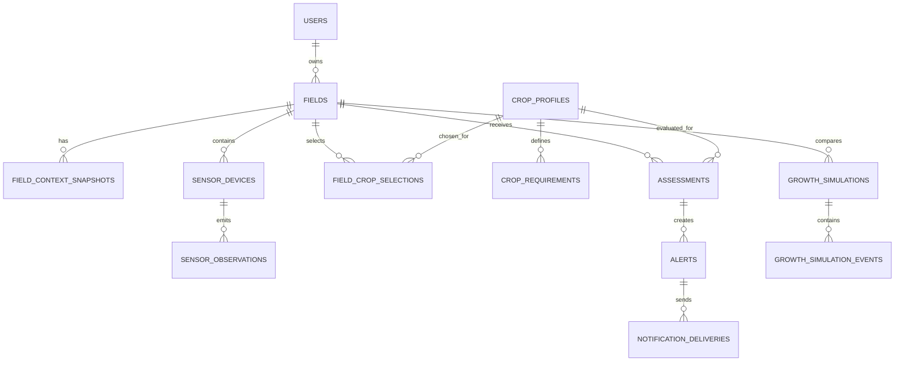

# AgroGuard - Database Schema

## Database goals

The database stores the explainable history behind a crop decision. It must distinguish field context, live measurements, derived assessments, notifications, and illustrative growth simulations. PostgreSQL is the default. PostGIS should be enabled when field geometry or spatial queries are needed.

The 24-hour MVP can run with one seeded field and one crop, but the schema must not hard-code that limitation.

## Shared rules

- Every table has a stable primary key, creation timestamp, and update timestamp where the record can change.
- Store event times in UTC.
- Use decimal values for measurements where rounding matters; do not store pH or coordinates as display strings.
- Store unit and source metadata with imported or simulated measurements.
- Use soft lifecycle states for alerts, devices, and fields; do not destroy history from the main UI.
- Use migrations for every schema change.
- Keep raw external payloads in a bounded provider-cache table or object store, not in core domain columns.
- Never store Telegram bot tokens or other secrets in the database.

## Tables

### 1. `users`

| Column | Type/meaning | Rules |
|---|---|---|
| `id` | UUID or bigint | Primary key |
| `display_name` | Text | Required |
| `email` | Text | Optional for demo; unique when present |
| `role` | Enum | Farmer, manager, agronomist, admin |
| `status` | Enum | Active or disabled |
| `created_at` | UTC timestamp | Required |

### 2. `fields`

| Column | Type/meaning | Rules |
|---|---|---|
| `id` | UUID or bigint | Primary key |
| `owner_id` | Foreign key | Nullable for public seeded demo field |
| `name` | Text | Required |
| `location` | PostGIS point/geography | WGS84; required when mapped |
| `boundary` | PostGIS polygon/geography | Optional for MVP; validate shape and size |
| `area_hectares` | Decimal | Positive when known |
| `region_label` | Text | Human-readable location |
| `status` | Enum | Active, archived |
| `is_demo` | Boolean | Separates seeded data from user data |
| `created_at` | UTC timestamp | Required |

Index the location and owner id. Never expose exact private coordinates in public views without permission.

### 3. `crop_profiles`

| Column | Type/meaning | Rules |
|---|---|---|
| `id` | UUID or bigint | Primary key |
| `name` | Text | Required |
| `variety` | Text | Optional |
| `export_use_case` | Text | Quality or market note |
| `season_start` / `season_end` | Date or day-of-year | Optional |
| `profile_version` | Text | Required for reproducibility |
| `source_type` | Enum | Published source, expert input, demo assumption |
| `source_reference` | Text | URL, document, or internal note |
| `is_active` | Boolean | Only active profiles are selectable |

### 4. `crop_requirements`

Stores the target range and importance of each crop factor.

| Column | Type/meaning | Rules |
|---|---|---|
| `id` | UUID or bigint | Primary key |
| `crop_id` | Foreign key | Required |
| `factor` | Enum | Temperature, humidity, soil moisture, pH, light, rainfall, elevation |
| `minimum_value` | Decimal | Optional when open-ended |
| `maximum_value` | Decimal | Optional when open-ended |
| `unit` | Text | Required and consistent with factor |
| `weight` | Decimal | Non-negative; used by suitability scorer |
| `criticality` | Enum | Advisory, important, critical |
| `source_reference` | Text | Required unless marked demo assumption |

Unique constraint: crop + factor + profile version.

### 5. `field_context_snapshots`

Stores the baseline context used for an assessment.

| Column | Type/meaning | Rules |
|---|---|---|
| `id` | UUID or bigint | Primary key |
| `field_id` | Foreign key | Required |
| `soil_type` | Text | Nullable when unavailable |
| `soil_ph` | Decimal | Estimated or measured with quality label |
| `organic_matter` | Decimal | Optional |
| `temperature_baseline` | Decimal | Unit is Celsius |
| `rainfall_baseline` | Decimal | Unit is millimeters per selected period |
| `elevation_meters` | Decimal | Optional |
| `source_name` | Text | Required |
| `source_reference` | Text | URL or dataset id |
| `retrieved_at` | UTC timestamp | Required |
| `quality` | Enum | Live, cached, seeded, estimated |

### 6. `sensor_devices`

| Column | Type/meaning | Rules |
|---|---|---|
| `id` | UUID or bigint | Primary key |
| `field_id` | Foreign key | Required |
| `device_key` | Text | Unique, never a secret token |
| `transport` | Enum | Wokwi, Wi-Fi, LoRaWAN, 4G, manual |
| `firmware_version` | Text | Optional |
| `last_seen_at` | UTC timestamp | Updated on valid reading |
| `status` | Enum | Active, stale, disabled |
| `is_simulated` | Boolean | Required |

### 7. `sensor_observations`

Each row is one normalized observation event.

| Column | Type/meaning | Rules |
|---|---|---|
| `id` | UUID or bigint | Primary key |
| `event_id` | Text | Unique per source event for idempotency |
| `device_id` | Foreign key | Required |
| `field_id` | Foreign key | Required |
| `observed_at` | UTC timestamp | Required; bounded future skew |
| `temperature_c` | Decimal | Plausible range validation |
| `humidity_percent` | Decimal | 0 to 100 |
| `soil_moisture_percent` | Decimal | 0 to 100; demo-normalized |
| `soil_ph` | Decimal | 0 to 14; demo estimate when from potentiometer |
| `light_percent` | Decimal | 0 to 100; demo-normalized |
| `source_mode` | Enum | Live, simulated, manual, replay |
| `quality` | Enum | Good, suspect, stale, invalid |
| `received_at` | UTC timestamp | Required |

Index field + observed_at and device + event_id.

### 8. `field_crop_selections`

Associates a field with the crop and season used by the decision loop.

| Column | Type/meaning | Rules |
|---|---|---|
| `id` | UUID or bigint | Primary key |
| `field_id` | Foreign key | Required |
| `crop_id` | Foreign key | Required |
| `season_label` | Text | Required for a selected plan |
| `selected_at` | UTC timestamp | Required |
| `selected_by` | Foreign key | Optional in demo |
| `status` | Enum | Active, completed, cancelled |

Only one active selection per field and season should be allowed.

### 9. `assessments`

Stores the derived decision so the result can be explained and replayed.

| Column | Type/meaning | Rules |
|---|---|---|
| `id` | UUID or bigint | Primary key |
| `field_id` | Foreign key | Required |
| `crop_id` | Foreign key | Required |
| `observation_id` | Foreign key | Nullable for baseline-only assessment |
| `context_snapshot_id` | Foreign key | Required |
| `status` | Enum | Healthy, warning, critical |
| `health_score` | Integer | 0 to 100; nullable if unavailable |
| `primary_risk` | Enum/text | Required for warning or critical |
| `recommendation` | Text | Plain-language action |
| `confidence` | Enum | High, medium, low, unknown |
| `decision_mode` | Enum | Rules, model, provider, fallback |
| `evidence` | JSON document | Bounded explanation values and ranges |
| `created_at` | UTC timestamp | Required |

### 10. `alerts`

| Column | Type/meaning | Rules |
|---|---|---|
| `id` | UUID or bigint | Primary key |
| `field_id` | Foreign key | Required |
| `assessment_id` | Foreign key | Required |
| `fingerprint` | Text | Unique within active cooldown policy |
| `severity` | Enum | Warning, critical |
| `risk_type` | Enum/text | Dry soil, heat stress, pH risk, low light, sensor stale |
| `message` | Text | Safe plain-language message |
| `status` | Enum | Open, acknowledged, resolved, suppressed |
| `opened_at` | UTC timestamp | Required |
| `resolved_at` | UTC timestamp | Optional |

### 11. `notification_deliveries`

| Column | Type/meaning | Rules |
|---|---|---|
| `id` | UUID or bigint | Primary key |
| `alert_id` | Foreign key | Required |
| `channel` | Enum | Telegram, in-app |
| `destination_ref` | Text | Safe chat or destination reference; not a token |
| `delivery_key` | Text | Unique for idempotent sending |
| `status` | Enum | Pending, sent, failed, suppressed |
| `attempt_count` | Integer | Non-negative |
| `last_error_code` | Text | No secret or raw token |
| `sent_at` | UTC timestamp | Optional |

### 12. `growth_simulations`

| Column | Type/meaning | Rules |
|---|---|---|
| `id` | UUID or bigint | Primary key |
| `field_id` | Foreign key | Required |
| `crop_id` | Foreign key | Required |
| `scenario_type` | Enum | IoT guided, normal control |
| `seed` | Text | Required for repeatable replay |
| `timeline_start` | Date | Required |
| `timeline_end` | Date | Required; one-year demo window |
| `status` | Enum | Ready, running, completed |
| `is_illustrative` | Boolean | Always true for hackathon growth story |

### 13. `growth_simulation_events`

Stores stage changes and interventions shown in the comparison.

| Column | Type/meaning | Rules |
|---|---|---|
| `id` | UUID or bigint | Primary key |
| `simulation_id` | Foreign key | Required |
| `event_date` | Date | Within simulation range |
| `growth_stage` | Enum/text | Germination, vegetative, flowering, fruiting, harvest |
| `health_index` | Integer | Illustrative 0 to 100 |
| `intervention` | Text | Optional action or missed action |
| `risk_marker` | Text | Optional |

### 14. `audit_events`

Use for important state changes: crop selection, assessment creation, alert acknowledgement, demo reset, and provider mode changes. Keep payloads bounded and redact secrets.

## Relationships

## Constraints and indexes

- Unique `sensor_observations.event_id` per source system.
- Unique active `notification_deliveries.delivery_key`.
- Unique active field crop selection per field and season.
- Check all percentage values are between 0 and 100.
- Check pH values are between 0 and 14.
- Check latitude and longitude ranges before persistence.
- Index observations by field and observed time.
- Index alerts by field, status, severity, and opened time.
- Spatial index field geometry when PostGIS is enabled.

## Seed data policy

Seed one clearly named demo field, one crop profile, one simulated device, safe baseline values, and at least three replay scenarios: healthy, dry-soil critical, and heat-stress warning. All seed values must carry `is_demo` or `source_mode=simulated`.

## Migration and rollback policy

- Every schema change is a reviewed migration.
- Add nullable fields before making them required.
- Backfill before adding a restrictive constraint.
- Never reset or drop a shared database during feature work.
- Keep demo reset limited to rows marked as demo data.
- Verify migrations against an empty database and a seeded database before pushing.
